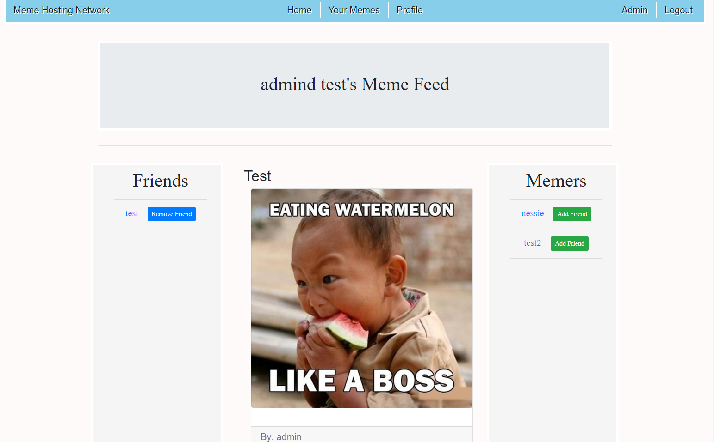
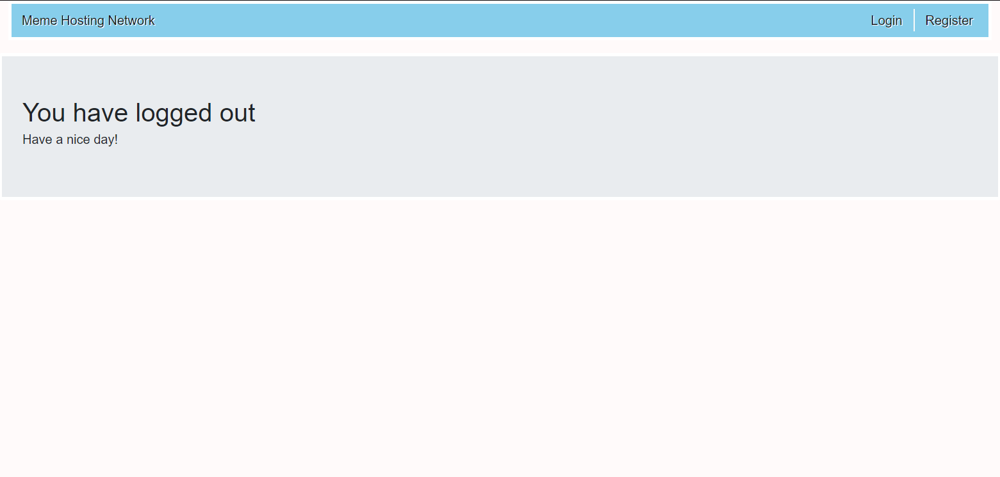
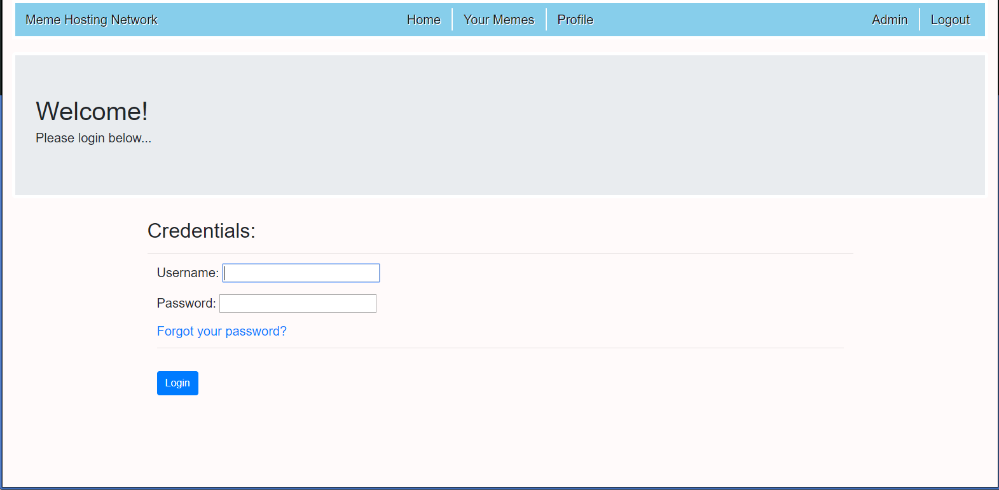

# Django--VideoStreamingSite
# 
# A simple Django application that users can share their favorite memes with each other!
#
# Getting Started
#These instructions will get you a copy of the project up and running on your local machine for #development and testing purposes. See deployment for notes on how to deploy the project on a live system.

#1.) Start your virtual environment  
#2.) install programs from requirements.txt (Windows w/ pip - pip install requirements.txt)  
#3.) Create superuser - python manage.py createsuperuser  
#4.) Make migrations - python manage.py makemigrations  
#5.) Migrate - python manage.py migrate\n
#6.) Start server from root directory of project - python manage.py runserver  
#7.) Navigate to 127.0.0.1  
#8.) Create a user and login. Share some of your favorite memes!

# Running the tests

# Built With
#Django - The web framework used  
#Pillow - Image  
#localflavor - Custom state field  
#bootstrap = markup  

# Contributing
#Please read CONTRIBUTING.md for details on our code of conduct, and the process for submitting pull #requests to us.

# Authors
#John Zika -- initial work  
#See also the list of contributors who participated in this project.

# Acknowledgments
#Max Goodridge - Amazing tutorials on how to create a Django site  
#Class of ITEC 2905
